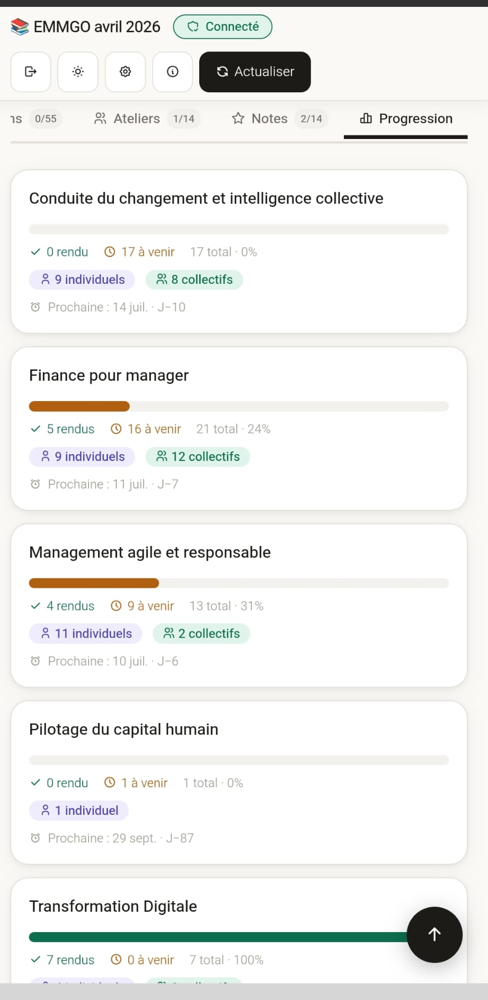
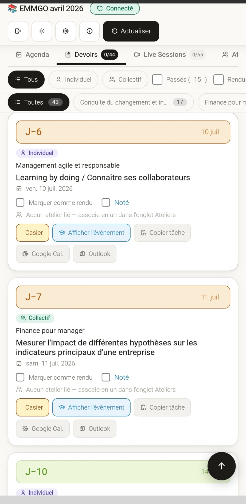
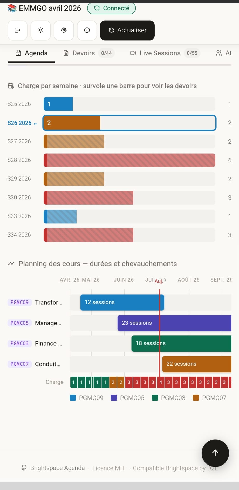
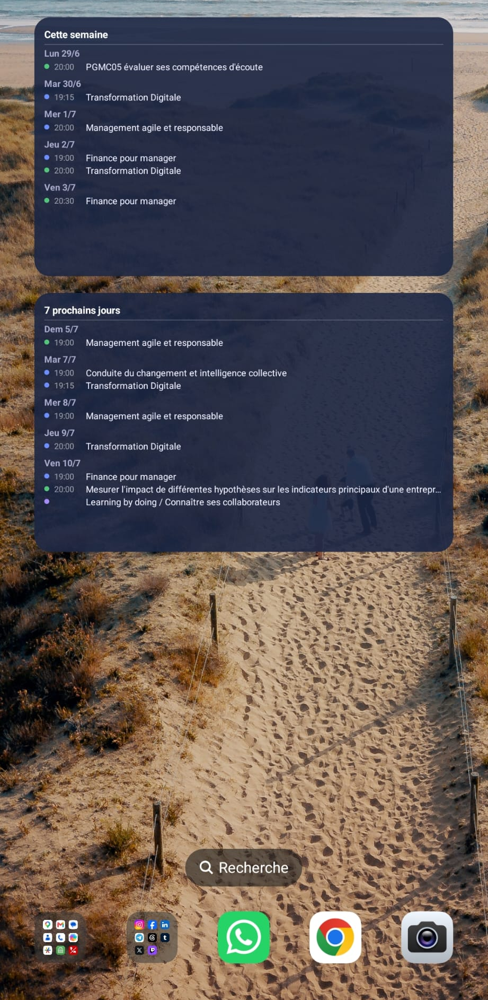
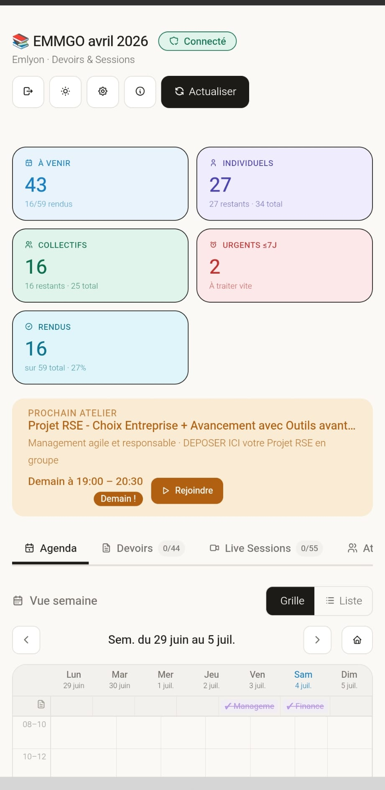

# 📱 Brightspace Agenda — APK Android

Application Android native (Capacitor) pour suivre tes devoirs, live sessions et ateliers depuis **Brightspace by D2L**.

> Ce dépôt contient le projet **Android / APK**. Le dépôt principal (serveur web + PWA) est sur [MrTh0m/Brightspace_agenda](https://github.com/MrTh0m/Brightspace_agenda).

---

## 📸 Aperçu

<div align="center">

| Accueil & Agenda | Devoirs | Progression |
|:---:|:---:|:---:|
|  |  |  |

| Widgets semaine | Widgets charge & devoirs |
|:---:|:---:|
|  |  |

</div>

---

## 🏗 Stack technique

| Composant | Technologie |
|---|---|
| Interface | HTML / CSS / JS — `index.html` source unique (web + APK) |
| Packaging Android | [Capacitor](https://capacitorjs.com/) v8 |
| Backend optionnel | PHP (`api.php`) auto-hébergé |
| Notifications | `@capacitor/local-notifications` |
| Widgets Android | Kotlin natif (`AppWidgetProvider`) + `capacitor-widget-bridge` |
| Deep linking | Scheme custom `bsa://` via `@capacitor/app` |

---

## 🔐 Modes de fonctionnement

### Mode local
URL ICS et données stockés uniquement sur le téléphone. Aucun serveur requis.

### Mode lecture seule
Accès en lecture seule via un token de partage fourni par un autre utilisateur du mode connecté.

### Mode connecté
Connexion à une instance `api.php` auto-hébergée : synchronisation multi-appareils, URLs ICS stockées côté serveur, partage possible.

---

## 📦 Dépendances npm

```json
{
  "@capacitor/core": "^8.4.1",
  "@capacitor/android": "^8.4.1",
  "@capacitor/cli": "^8.4.1",
  "@capacitor/app": "^8.1.0",
  "@capacitor/local-notifications": "^8.2.0",
  "@capacitor/preferences": "^8.x",
  "capacitor-widget-bridge": "^8.1.0"
}
```

---

## 🔔 Notifications

Les notifications sont programmées **à l'avance** dès le chargement du calendrier ICS, sans dépendance à un timer actif.

| Déclencheur | Horaire |
|---|---|
| Devoir approchant | J−3 et J−1 à 8h |
| Programme du jour | Ce jour à 8h |
| Devoir collectif sans atelier | J−1 à 8h |
| Événement imminent | 15 min avant (tolérance 30 min) |

> **Prérequis Android** : autoriser l'app en mode batterie **"Sans restriction"** (Paramètres → Batterie → Brightspace Agenda) pour que les alarmes passent le Doze mode.

---

## 🧩 Widgets Android

7 widgets disponibles depuis l'écran d'accueil Android :

| Widget | Taille | Contenu |
|---|---|---|
| Prochain événement | 3×1 | Prochain cours ou atelier, temps restant |
| Agenda du jour | 2×2 | Événements du jour avec heure et type |
| Devoirs à rendre | 2×2 | Liste par urgence, nombre adaptatif à la taille |
| Progression | 3×2 | Avancement par matière avec barres |
| Cette semaine | 4×2 | Vue liste lun→dim, événements par jour |
| 7 prochains jours | 4×2 | Vue liste glissante, même structure |
| Charge par semaine | 4×2 | Barres rendus/à rendre par semaine ISO |

Les widgets se mettent à jour automatiquement à chaque ouverture de l'app.

---

## 🔗 Deep linking

Scheme custom `bsa://` pour naviguer directement vers un onglet depuis une notification ou un widget.

| URL | Action |
|---|---|
| `bsa://tab/agenda` | Ouvre l'onglet Agenda |
| `bsa://tab/devoirs` | Ouvre l'onglet Devoirs |
| `bsa://tab/sessions` | Ouvre l'onglet Live Sessions |
| `bsa://tab/groupe` | Ouvre l'onglet Ateliers |
| `bsa://tab/prog` | Ouvre l'onglet Progression |
| `bsa://teams?url=...` | Ouvre le lien Teams dans le navigateur |

---

## 🛠 Build

### Prérequis
- Node.js + npm
- Android Studio avec SDK Android 36
- JDK 17+

### Workflow

```bash
# 1. Installer les dépendances
npm install

# 2. Copier index.html dans www/ (source de vérité unique)
cp ../Brightspace_agenda/index.html www/

# 3. Synchroniser avec Android
npx cap sync android

# 4. Build signé dans Android Studio
# Build > Generate Signed Bundle / APK > APK > release
```

### Permissions Android requises

À ajouter dans `AndroidManifest.xml` :

```xml
<uses-permission android:name="android.permission.POST_NOTIFICATIONS" />
<uses-permission android:name="android.permission.SCHEDULE_EXACT_ALARM" />
```

### Icônes

Générées via **Android Studio → New → Image Asset** :
- **Launcher** : `ic_launcher_foreground_1024.png` + `ic_launcher_background_1024.png` → Launcher Icons (Adaptive and Legacy)
- **Notification** : `ic_stat_notify_1024.png` → Notification Icons, name = `ic_stat_notify`

---

## 🔑 Keystore

Le fichier `.jks` est exclu du dépôt (`.gitignore`).  
**Garde-en une copie hors dépôt** — il est indispensable pour publier des mises à jour de la même app.

---

## 📄 Licence

MIT License — Copyright (c) 2025 MrTh0m  
Compatible avec tout établissement utilisant Brightspace by D2L.
